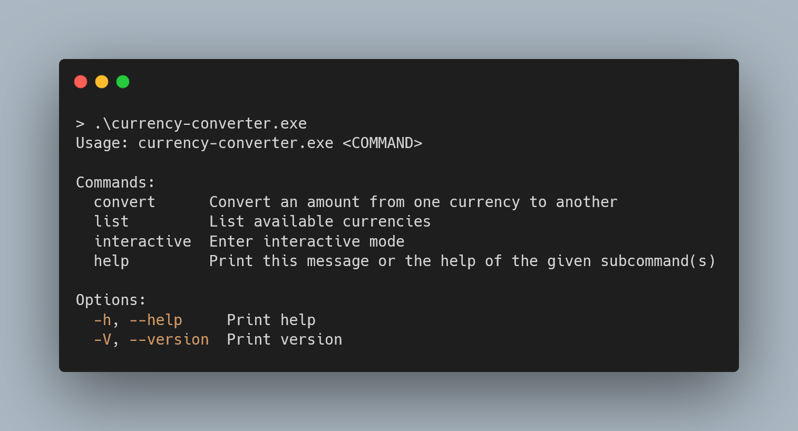
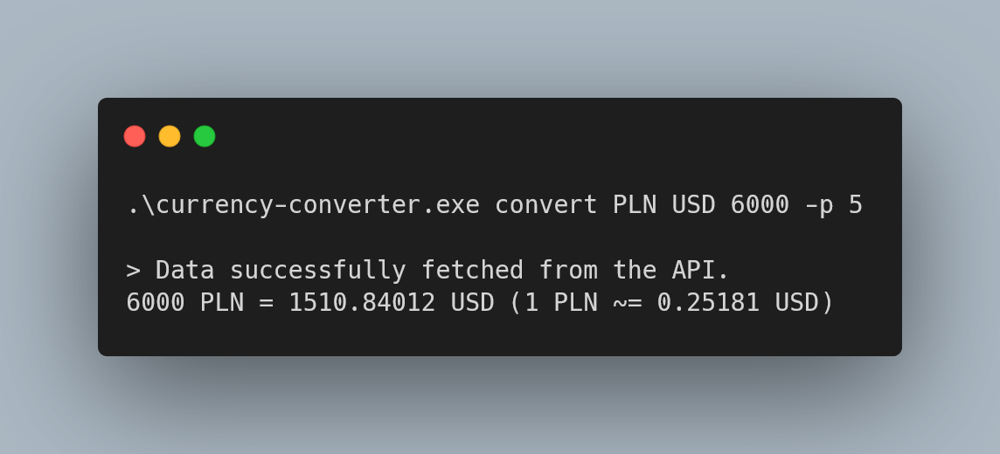
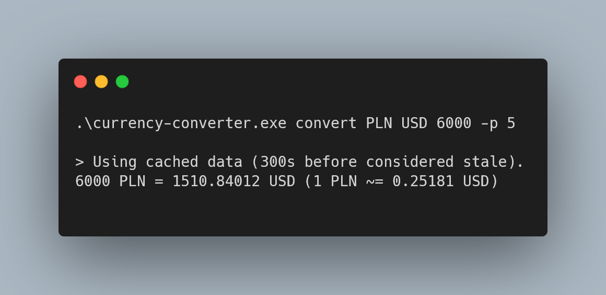
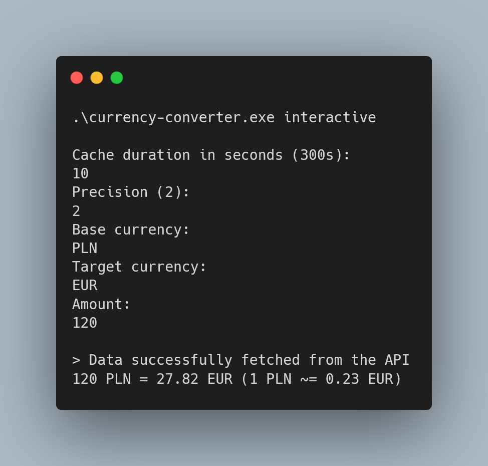

# Currency converter

A simple CLI tool to convert currencies using the
[currencyapi.com](https://currencyapi.com/) API.

-   [Installation](#installation-and-setup)
-   [Usage](#usage)
-   [Examples](#examples)
-   [Additional notes](#additional-notes)

## Features

-   Converting between supported currencies
-   Caching the exchange rates
-   Listing all supported currencies
-   Interactive mode
-   Ability to specify the desired precision and cache duration

## Screenshots









## Installation and setup

### Building

The tool can be either built from source, built as a Docker image or run directly using the pre-built Docker image or binary (available in the releases section).

#### Building binary from source

When building on linux, the following packages are required:

-   `libssl-dev`
-   `pkg-config`
-   `openssl`

```bash
apt install libssl-dev pkg-config openssl
```

Additionally, the projects was developed using Rust `1.76.0`, so it is recommended to use the same version to avoid any potential issues.

```bash
cargo build --release
```

#### Building as a Docker image

```bash
docker build -t currency-converter .
```

### Loading the Docker image

The Docker image available in the releases section can be loaded using the following command:

```bash
docker load -i currency-converter-docker-<version>.tar
```

### API key

The tool requires an API key from [currencyapi.com](https://currencyapi.com/). The API key is read from the environment variable `CURRENCY_API_KEY`, which needs to be set beforehand. The API has a free tier which allows for 300 requests per month.

## Usage

### Running the binary

The binary can be run directly after building it, provided that the `CURRENCY_API_KEY` environment variable is set.

In bash:

```bash
export CURRENCY_API_KEY=your_api_key
```

```bash
./currency-converter
```

Or in PowerShell:

```powershell
$env:CURRENCY_API_KEY="your_api_key"
```

```powershell
.\currency-converter.exe
```

### Using cargo run

The tool can also be run using `cargo run`, the API key should be set as described above.

```bash
cargo run
```

### Using the Docker image

The Docker image can be run using the following command:

```bash
docker run -e CURRENCY_API_KEY=<your_api_key> -v data:/data/ -ti currency-converter
```

The volume is optional, but it is recommended to use it to persist the cache between runs.

### Commands

The tool supports the following commands:

-   `convert` - Convert between two currencies
-   `list` - List all supported currencies
-   `interactive` - Start the interactive mode

The commands can be run using the following syntax:

```bash
./currency-converter <command> [args]
```

### Examples

#### Convert

Convert 100 USD to EUR, using the default precision and cache duration:

```bash
./currency-converter convert USD EUR 100
```

Convert 100 USD to EUR, using a precision of 4 and a cache duration of 1 hour:

```bash
./currency-converter convert USD EUR 100 -p 4 -c 3600
```

#### List

List all supported currencies:

```bash
./currency-converter list
```

#### Interactive

The interactive mode can be started by running the following command:

```bash
./currency-converter interactive
```

The interactive mode supports the same arguments as the `convert` command, but they are entered interactively. First, the user is prompted to enter the cache duration and the desired precision. Then, the user will be prompted to enter the amount and the base and target currencies in a loop until the user decides to exit (`CTRL+C`) the interactive mode.

## Additional notes

-   The project was structured in a way to be "API agnostic", meaning that it should be fairly easy to add support for other currency exchange APIs (or any other data source) if needed. Current API response is transformed into a simple and (hopefully) quite universal struct, which is then used throughout the project, thus, as long as the new data source can be transformed into the same struct, the rest of the project should work without many fundamental changes.

-   The use of concurrency is currently unnecessary, as the singular API request could be made synchronously. However it's use could be beneficial e.g. if the project was to be expanded to support multiple data sources, possibly queried in parallel.

-   The project has two Github actions setup, one for running the tests and one for building the Docker image and a linux binary. Both the binary and the Docker image are uploaded to the Github releases section.
